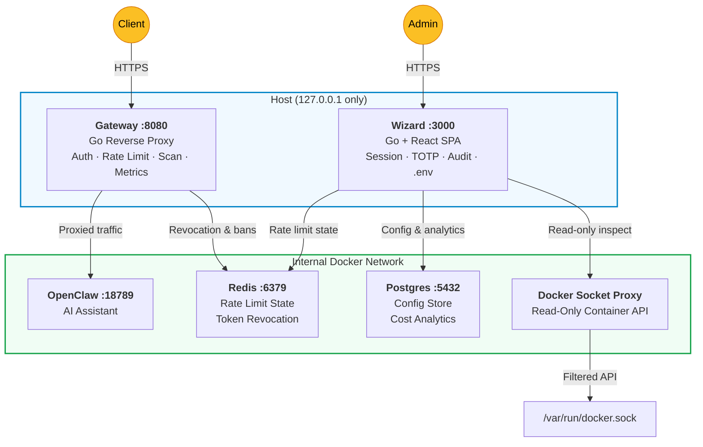
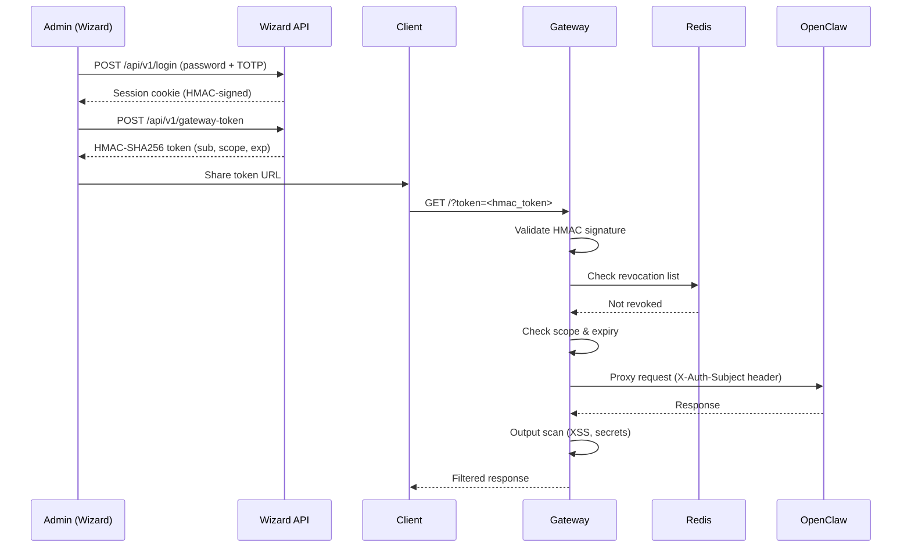
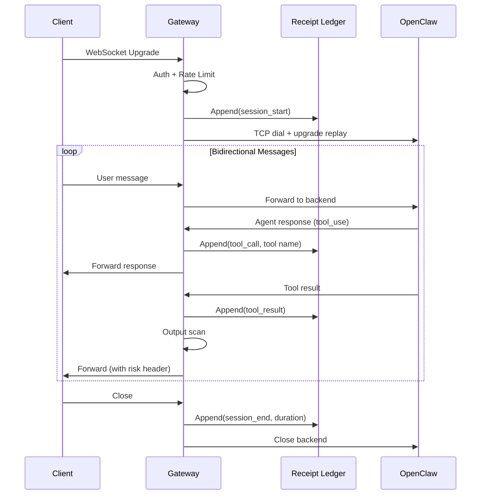
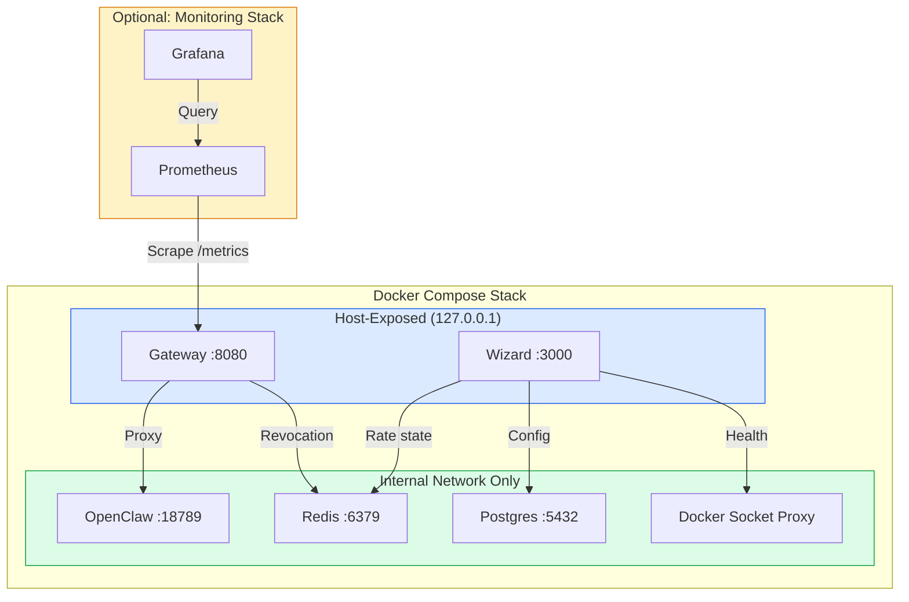

<p align="center">
  <strong>InstallerClaw (SafePaw)</strong><br/>
  Secure, one-click deployer for OpenClaw
</p>

<p align="center">
  <a href="#quickstart"><strong>Quickstart</strong></a> &middot;
  <a href="#part-2-tech-stack--architecture"><strong>Architecture</strong></a> &middot;
  <a href="https://github.com/beautifulplanet/SafePaw"><strong>GitHub</strong></a> &middot;
  <a href="SECURITY.md"><strong>Security</strong></a> &middot;
  <a href="RUNBOOK.md"><strong>Runbook</strong></a> &middot;
  <a href="docs/adr/"><strong>ADRs</strong></a> &middot;
  <a href="CHANGELOG.md"><strong>Changelog</strong></a>
</p>

<p align="center">
  <a href="https://github.com/beautifulplanet/SafePaw/actions/workflows/ci.yml"></a>
  <a href="LICENSE"></a>
  <a href="https://github.com/beautifulplanet/SafePaw/stargazers"></a>
  
  
  
  
  
</p>

<br/>

## What is InstallerClaw?

# Secure perimeter for self-hosted AI assistants

**If OpenClaw is the _AI assistant_, InstallerClaw is the _security guard + setup crew_ around it.**

InstallerClaw is a Go gateway and React wizard that wraps [OpenClaw](https://github.com/nicepkg/openclaw) in a hardened Docker environment. Auth, rate limiting, prompt-injection scanning, TLS, and guided setup — one command to deploy, one UI to manage.

We call it **InstallerClaw** because it is the install and deploy layer around OpenClaw. The repo is named **SafePaw** for historical reasons; treat "InstallerClaw" as the product name and "SafePaw" as the codebase name.

**The trend:** Self-hosted AI assistants (OpenClaw, and similar local/private LLM front-ends) are growing fast. InstallerClaw is a safe, deployable perimeter — auth, scanning, and ops in one place — so you never expose the assistant without a guardrail layer.

<br/>

## InstallerClaw is right for you if

- ✅ You run **OpenClaw** (or any self-hosted AI assistant) and want a security layer in front of it
- ✅ You want **one command** to deploy a hardened stack with auth, rate limiting, and scanning
- ✅ You're **not a security expert** but want defense-in-depth without building it yourself
- ✅ You need **operational tooling** — health dashboard, config UI, audit logs, incident runbooks
- ✅ You want **guided setup** instead of editing YAML files and hoping for the best
- ✅ You care about **prompt injection defense** and want heuristic scanning on every request

<br/>

## Features

<table>
<tr>
<td align="center" width="33%">
<h3>🛡️ Security Gateway</h3>
HMAC auth, per-IP rate limiting, brute-force banning, origin validation, TLS termination. Every request authenticated before it reaches the AI.
</td>
<td align="center" width="33%">
<h3>🔍 AI Defense Scanning</h3>
14-pattern prompt injection body scanner + output scanner (XSS, secret leaks). Heuristic, versioned, auditable. Risk headers on every response.
<br/><br/>
<strong>Defense-in-depth layer.</strong> Pattern-based scanning catches common prompt injection vectors as part of a multi-layer security posture. See <a href="THREAT-MODEL.md">THREAT-MODEL.md</a> for the full threat model.
</td>
<td align="center" width="33%">
<h3>🧙 Setup Wizard</h3>
React UI with guided setup: prerequisite checks, API key config, service health dashboard, masked secrets. No YAML editing required.
</td>
</tr>
<tr>
<td align="center">
<h3>🔐 Auth & Sessions</h3>
HMAC-SHA256 tokens, Redis-backed revocation, scope enforcement. Wizard has optional TOTP MFA, signed session cookies, audit trail.
</td>
<td align="center">
<h3>📊 Observability</h3>
Prometheus metrics, Grafana dashboards, 6 alert rules, structured JSON logging. SIEM-ready out of the box.
</td>
<td align="center">
<h3>🐳 One-Command Deploy</h3>
<code>docker compose up -d</code> — 5 services with health checks, resource limits, and internal-only backends. Only wizard and gateway exposed.
</td>
</tr>
<tr>
<td align="center">
<h3>📋 Incident Runbooks</h3>
6 playbooks: token compromise, injection detected, gateway down, brute force, secret rotation, disk full. Copy-paste commands.
</td>
<td align="center">
<h3>🧪 322 Tests</h3>
Go unit and integration tests, 7 fuzz targets, coverage gate (65%) in CI. Lint, gosec, govulncheck, Trivy container scan on every push.
</td>
<td align="center">
<h3>📐 Threat Model</h3>
STRIDE analysis with 27 documented threats, mitigations, and residual risks. Defense-in-depth, not security theater.
</td>
</tr>
</table>

<br/>

## Problems InstallerClaw solves

| Without InstallerClaw | With InstallerClaw |
|---|---|
| ❌ OpenClaw is exposed directly — no auth, no rate limiting, no scanning. | ✅ Gateway sits in front with HMAC auth, brute-force protection, and prompt-injection scanning on every request. |
| ❌ You manually configure `.env` files, hope Docker ports are right, and debug health checks. | ✅ Wizard UI walks you through setup: prerequisites, API keys, service health — all from a browser. |
| ❌ When something breaks, you dig through logs trying to figure out what happened. | ✅ Structured logging, Prometheus metrics, Grafana dashboards, and 6 incident runbooks with copy-paste commands. |
| ❌ You have no audit trail — who logged in, what changed, when services restarted. | ✅ Wizard audit log records every login, config change, restart, and token creation with timestamps and IPs. |
| ❌ Prompt injection attacks go straight to the AI with no filtering. | ✅ 14-pattern body scanner + output scanner catch common injection and exfiltration attempts before they reach OpenClaw. |
| ❌ Secret rotation means editing files, restarting services, and hoping nothing breaks. | ✅ Runbook has ordered rotation procedures; wizard UI edits `.env` and restarts services in place. |

<br/>

## What InstallerClaw is and is not

| | |
|---|---|
| **Not the AI itself.** | OpenClaw handles the assistant, channels, and LLM integration. InstallerClaw handles the perimeter. |
| **Complementary scanning.** | Pattern-based heuristic scanning provides broad attack coverage. The full STRIDE model documents 27 threats with mitigations. See [THREAT-MODEL.md](THREAT-MODEL.md). |
| **Designed for indie and small-team deployments.** | Production-ready for single-instance use. Enterprise environments can layer additional controls (WAF, external IdP) as needed. |
| **Fully self-hosted.** | No accounts, no telemetry, no external dependencies at runtime. 100% private. |
| **Focused scope.** | InstallerClaw secures and operates a single AI stack with depth, rather than breadth. |

<br/>

<div align="center">
<table>
  <tr>
    <td align="center"><strong>Wraps</strong></td>
    <td align="center"><strong>OpenClaw</strong><br/><sub>AI Assistant</sub></td>
    <td align="center"><strong>Discord</strong><br/><sub>Channel</sub></td>
    <td align="center"><strong>Telegram</strong><br/><sub>Channel</sub></td>
    <td align="center"><strong>Slack</strong><br/><sub>Channel</sub></td>
    <td align="center"><strong>Redis</strong><br/><sub>State</sub></td>
    <td align="center"><strong>Postgres</strong><br/><sub>Config</sub></td>
  </tr>
</table>
</div>

<br/>

---

### Impact

- **Deploy in one command** — `docker compose up -d` from the repo root; six services (wizard, gateway, openclaw, redis, postgres, docker-socket-proxy) with health checks and internal-only backends.
- **All traffic through the gateway** — OpenClaw has no host-exposed ports. Auth, rate limiting, brute-force protection, and AI-defense scanning apply before any request reaches the assistant.
- **Wizard for ops** — React UI for admin login (session tokens, optional TOTP), prerequisites, live container status, and masked .env editing. Audit log for all admin actions.
- **258+ tests across gateway and wizard** — Go unit and integration tests, 7 fuzz targets, coverage gate (60%) in CI. Lint, gosec, govulncheck, Docker build on every push.
- **Operational docs** — Incident runbooks (6 types), backup/restore procedures, secret rotation, STRIDE threat model (27 threats). This readme is written for anyone running or evaluating the system.

**Stack:** Go · React 19 · TypeScript · Tailwind · Docker Compose · Redis · PostgreSQL · Prometheus · Grafana

---

### Evidence

| Claim | Proof |
|-------|--------|
| Stack runs locally | `docker compose up -d` — wizard :3000, gateway :8080 |
| Gateway health | `curl -s http://localhost:8080/health` — returns status + backend reachability |
| Prometheus metrics | `curl -s http://localhost:8080/metrics` — counters, histograms, gauges |
| 258+ Go tests | `cd services/gateway && go test ./... -race`; same under `services/wizard` |
| 7 fuzz targets | `make fuzz` (gateway middleware) |
| Vulnerability scan | `make vulncheck` — govulncheck on both services |
| Incident runbooks | [RUNBOOK.md](RUNBOOK.md) — token compromise, injection, gateway down, brute force, rotation, disk |
| Backup & recovery | [BACKUP-RECOVERY.md](BACKUP-RECOVERY.md) — Postgres, Redis, volumes, .env |
| Threat model | [THREAT-MODEL.md](THREAT-MODEL.md) — STRIDE, 27 threats, mitigations |

---

### Quality bar

- **Defense in depth** — Request path: metrics → headers → request ID → origin check → brute-force guard → rate limit → auth (HMAC + Redis revocation) → body scanner → output scanner → proxy. Each layer documented in [SECURITY.md](SECURITY.md).
- **STRIDE threat model** — Documented threats and mitigations; residual risks called out (e.g. heuristic-only scanning, in-memory brute-force bans).
- **Backup and secret rotation** — Procedures for Postgres, Redis, volumes, and .env; RUNBOOK includes ordered secret rotation and one-shot rotation block.
- **CI pipeline** — Build, test (`-race`), lint (golangci-lint), gosec, govulncheck, coverage gate (60%), fuzz seed corpus, Docker build.
- **Structured logging** — Gateway: JSON or text via `LOG_FORMAT`; wizard: audit log for login, config changes, restarts. SIEM-ready.

---

### How to read this README

**If you're evaluating the system**

| What you want | Where to find it | Time |
|---------------|------------------|------|
| What it is and why it exists | [What is InstallerClaw?](#what-is-installerclaw) + [Part 1: Summary](#part-1-summary) | 1 min |
| Proof (tests, metrics, docs) | [Evidence](#evidence) | 1 min |
| Security and ops posture | [Part 2: Tech stack & architecture](#part-2-tech-stack--architecture), [Security posture](#security-posture) | 2 min |
| Design boundaries | [Design Boundaries](#design-boundaries) | 30 sec |

**If you're reviewing security & operations**

| What you want | Where to find it | Time |
|---------------|------------------|------|
| Request flow and boundaries | [Architecture](#architecture), [Request flow](#request-flow) | 1 min |
| Threat model and mitigations | [THREAT-MODEL.md](THREAT-MODEL.md), [Security posture](#security-posture) | 3 min |
| Incident and backup procedures | [RUNBOOK.md](RUNBOOK.md), [BACKUP-RECOVERY.md](BACKUP-RECOVERY.md) | 2 min |
| Config and env vars | [Configuration](#configuration) | 1 min |

**If you want to run it**

| What you want | Where to find it | Time |
|---------------|------------------|------|
| Clone and run in a few minutes | [Part 3: Quick start](#part-3-quick-start) | 2 min |
| Full setup and dev commands | [Development](#development), [Testing](#testing) | 5 min |
| Troubleshooting | [Troubleshooting](#troubleshooting), [Verify deployment](#verify-deployment) | 2 min |

---

# Part 1: Summary

_What this is, what it does, why it matters._

### What

SafePaw combines:

- **Go gateway** — Reverse proxy with HMAC auth, Redis-backed revocation, per-IP rate limiting, brute-force IP banning, 14-pattern prompt-injection body scanner, output scanner (XSS, secret leaks), security headers, origin validation, server-generated request IDs, optional TLS, Prometheus metrics, structured JSON logging.
- **Go + React wizard** — Single-binary setup UI (React embedded via `go:embed`): admin login with HMAC session tokens and optional TOTP, prerequisite checks (Docker, Compose, ports, disk), live container dashboard, masked .env edit, service restart, audit log.
- **Five-service Compose stack** — Wizard, gateway, OpenClaw, Redis, Postgres; only wizard and gateway exposed on the host (127.0.0.1). OpenClaw and data stores are internal only.

OpenClaw handles the AI assistant, channels (Discord, Telegram, Slack, etc.), and LLM integration. SafePaw handles the perimeter.

### Why it's interesting (for reviewers)

| Topic | Detail |
|-------|--------|
| Security layering | Defense in depth with brute-force guard fed by auth failures and rate-limit hits; Redis-backed revocation; STRIDE threat model. |
| AI defense | Heuristic body scanner (14 patterns, versioned) + response/output scanner; risk levels and `X-SafePaw-Risk` header. |
| Zero-dependency choices | Gateway: no JWT library (custom HMAC tokens), no Redis client lib (minimal RESP client), no Docker SDK (raw Engine API over Unix socket). |
| Testing | 258+ tests, 7 fuzz targets, integration tests for auth/rate-limit/revocation/scope, coverage gate and govulncheck in CI. |
| Operations | Runbooks, backup/restore, secret rotation order, Grafana alerts, structured logging. |
| Wizard UX | Session tokens + optional TOTP, audit trail, prerequisite checks, live Docker status. |

### Key numbers

| Metric | Value |
|--------|--------|
| Go tests (gateway) | 195+ (middleware, config, integration, fuzz) |
| Go tests (wizard) | 63+ (session, TOTP, middleware, API, config, audit) |
| Fuzz targets | 7 (prompt injection, sanitize, channel, output scan, token, KV) |
| CI jobs | 5 (gateway build+test, wizard build+test, lint, security, Docker) |
| Runbook playbooks | 6 (token compromise, injection, gateway down, brute force, rotation, disk) |
| Threat model entries | 27 (STRIDE, all mitigated with residual risks noted) |
| Prometheus metrics | Request counts, durations, auth failures, injections, connection gauge, path normalization |

---

# Part 2: Tech stack & architecture

### Stack

| Layer | Technology | Why |
|-------|------------|-----|
| Gateway | Go, net/http, httputil.ReverseProxy | Single binary, minimal deps (uuid only), full control over request/response path |
| Wizard backend | Go, go:embed | Serves React build + REST API; one binary, no nginx |
| Wizard frontend | React 19, TypeScript, Tailwind, Vite | Typed API client, SPA routing, modern tooling |
| Auth | HMAC-SHA256 (custom), Redis (optional) | Stateless tokens, scope enforcement, persistent revocation without JWT lib |
| Session (wizard) | HMAC-SHA256, optional TOTP (stdlib) | Signed cookies, replay-resistant (jti), optional MFA |
| Orchestration | Docker Compose | Five services, health checks, resource limits, internal network |
| Observability | Prometheus, Grafana | /metrics, dashboards, 6 alert rules; LOG_FORMAT=json for SIEM |
| Testing | go test, Vitest (wizard UI optional), fuzz | Unit, integration, fuzz; CI with race detector and coverage gate |

### Architecture



### Request flow


### Key design decisions

| Decision | Rationale |
|----------|-----------|
| OpenClaw not exposed to host | Single security perimeter; all traffic is authenticated, rate-limited, and scanned. |
| Auth and revocation in gateway | Stateless HMAC tokens; revocation in Redis so it survives restarts and is shared across instances. |
| Wizard reads Docker socket read-only | Health and container list only; no privilege escalation from UI. |
| Heuristic-only AI scanning | No ML/LLM dependency; patterns versioned and auditable; documented as a scope boundary. |
| Server-generated request IDs only | Client X-Request-ID ignored to avoid log injection and guarantee unique correlation IDs. |

### Auth token lifecycle



### WebSocket proxy with receipt ledger



### Deployment topology



### Security posture

| Boundary | Threat | Mitigation | Status |
|----------|--------|------------|--------|
| Gateway API | Unauthenticated access | AUTH_ENABLED=true default in Docker; HMAC tokens, scope enforcement | ✅ |
| Gateway API | Token reuse after compromise | Redis-backed revocation; POST /admin/revoke | ✅ |
| Gateway API | Brute force / abuse | Rate limit + brute-force guard (IP ban after N failures) | ✅ |
| Gateway API | Prompt injection / exfil | Body scanner (14 patterns) + output scanner | ✅ Heuristic |
| Gateway API | Spoofed identity when auth off | StripAuthHeaders removes X-Auth-Subject/Scope | ✅ |
| Wizard admin | Weak or missing password | Auto-generated secret if unset; strong password in .env recommended | ✅ |
| Wizard admin | Session replay | HMAC session tokens with jti (nonce) | ✅ |
| Wizard admin | Credential stuffing | Optional TOTP (WIZARD_TOTP_SECRET); rate limit + delay on fail | ✅ |
| Config | Secret leak in UI | .env keys masked in GET; PUT restricted to allowed list | ✅ |
| Operations | Data loss | BACKUP-RECOVERY.md; RUNBOOK secret rotation | ✅ Documented |

Full threat model: [THREAT-MODEL.md](THREAT-MODEL.md). Incident response: [RUNBOOK.md](RUNBOOK.md).

---

# Part 3: Quick start

### 3 commands, done

```bash
git clone https://github.com/beautifulplanet/SafePaw.git
cd SafePaw
./start.sh
```

That's it. The script checks Docker, generates all secrets, picks the right memory profile for your system, starts everything, and opens your browser.

**Windows:** run `start.bat` instead. **Demo mode** (no API key needed): `./start.sh --demo`

### What happens

1. **`start.sh`** generates `.env` with secure random passwords (Redis, Postgres, auth secret, wizard password)
2. Detects your RAM and sets the right `SYSTEM_PROFILE` (small/medium/large/very-large)
3. Runs `docker compose up -d --build`
4. Waits for healthchecks, prints your wizard password, opens `http://localhost:3000`

### Prerequisites

- Docker and Docker Compose (v2)
- Ports 3000 (wizard) and 8080 (gateway) free
- For production: set `AUTH_ENABLED=true`, `AUTH_SECRET`, and optionally `TLS_ENABLED` with certs

### Manual setup (advanced)

If you prefer to configure everything yourself:

```bash
cp .env.example .env
# Edit .env: API keys, channel tokens, AUTH_SECRET
docker compose up -d
# Wizard: http://localhost:3000 (password: docker compose logs wizard)
```

---

# Part 4: Configuration, development, and reference

## Configuration

All configuration via environment variables (`.env` in the repo root).

### Essential

| Variable | Description |
|----------|-------------|
| `ANTHROPIC_API_KEY` | Anthropic API key for OpenClaw |
| `OPENAI_API_KEY` | OpenAI API key (optional) |

### Channel tokens (optional)

| Variable | Description |
|----------|-------------|
| `DISCORD_BOT_TOKEN`, `TELEGRAM_BOT_TOKEN`, `SLACK_BOT_TOKEN`, `SLACK_APP_TOKEN` | Channel bot tokens |

### Security

| Variable | Default | Description |
|----------|---------|-------------|
| `AUTH_ENABLED` | `true` (Docker) | Enable gateway HMAC auth |
| `AUTH_SECRET` | — | HMAC signing key (min 32 bytes) |
| `TLS_ENABLED` | `false` | Enable TLS on gateway |
| `TLS_CERT_FILE`, `TLS_KEY_FILE` | /certs/... | TLS cert and key paths |
| `RATE_LIMIT` | 60 | Requests per minute per IP |
| `LOG_FORMAT` | `text` | `json` for SIEM-style logs |
| `WIZARD_ADMIN_PASSWORD` | auto-generated | Wizard admin password |
| `WIZARD_TOTP_SECRET` | — | Optional base32 TOTP for wizard MFA |

See [.env.example](.env.example) for the full list.

## Development

```bash
# Gateway
cd services/gateway
go build -o gateway .
PROXY_TARGET=http://localhost:18789 ./gateway

# Token (when auth enabled)
export AUTH_SECRET=$(openssl rand -base64 48)
go run tools/tokengen/main.go -sub admin -scope proxy -ttl 24h

# Wizard
cd services/wizard
go build -o wizard ./cmd/wizard
WIZARD_ADMIN_PASSWORD=dev ./wizard

# Wizard UI (hot reload)
cd services/wizard/ui
npm install && npm run dev
```

From the repo root: `make lint`, `make vulncheck`, `make fuzz`. See [CONTRIBUTING.md](CONTRIBUTING.md).

## Testing

| Suite | Location | Command |
|-------|----------|---------|
| Gateway | `services/gateway` | `go test ./... -race` |
| Wizard | `services/wizard` | `go test ./... -race` |
| Fuzz (gateway) | `services/gateway` | `go test -fuzz=...` or `make fuzz` |
| Vuln check | repo root | `make vulncheck` |
| E2E (live stack) | scripts/ | `./scripts/verify-deployment.sh` (after `docker compose up -d`) |

CI runs build, test with coverage gate (gateway 60%, wizard 55%), lint, gosec, govulncheck, and Docker build.

## Project structure

```
SafePaw/
├── docker-compose.yml       # 6 services, health checks, resource limits
├── Makefile                 # build, test, lint, vulncheck, fuzz, Docker
├── .env.example
├── go.work                  # Go workspace (gateway, wizard, mockbackend)
├── SECURITY.md              # Incident response, logging, hardening, MFA
├── RUNBOOK.md               # 6 playbooks, secret rotation
├── THREAT-MODEL.md          # STRIDE (27 threats)
├── BACKUP-RECOVERY.md       # Postgres, Redis, volumes, .env
├── CONTRIBUTING.md
├── monitoring/              # Prometheus, Grafana, alerts
├── services/
│   ├── gateway/             # Go reverse proxy, middleware, tools/tokengen
│   ├── wizard/              # Go + React (cmd, internal, ui)
│   ├── mockbackend/         # Test backend
│   ├── openclaw/            # OpenClaw Dockerfile
│   └── postgres/init/
├── _archived/               # Legacy / previous architecture
└── shared/proto/
```

## Troubleshooting

| Issue | What to do |
|-------|------------|
| Lost wizard admin password | `docker compose logs wizard` (first lines) or set `WIZARD_ADMIN_PASSWORD` in `.env` and restart. [SECURITY.md](SECURITY.md) § Recovery. |
| Prerequisites fail | Install Docker and Compose; ensure 3000 and 8080 are free. |
| Dashboard shows no services | Wizard needs read-only Docker socket; check compose mount for `/var/run/docker.sock` (or npipe on Windows). |
| Gateway 502 / backend unreachable | OpenClaw may still be starting. `docker compose logs openclaw`; `curl http://localhost:8080/health`. |
| Auth required | Set `AUTH_ENABLED=true` and `AUTH_SECRET`; use `tools/tokengen` to create tokens. |

## Verify deployment

```bash
curl -s http://localhost:3000/api/v1/health | jq .
curl -s http://localhost:8080/health | jq .
```

Then open http://localhost:3000, sign in, and check the dashboard. Full script: `./scripts/verify-deployment.sh`.

## FAQ

**What does a typical setup look like?**
Clone the repo, copy `.env.example` to `.env`, fill in your API keys, run `docker compose up -d`. The wizard at `:3000` guides you through the rest.

**Can I use this without OpenClaw?**
The gateway can proxy to any HTTP backend — change `PROXY_TARGET` in `.env`. The wizard's health checks and service management are OpenClaw-specific, but the gateway is generic.

**How do I add TOTP (MFA) to the wizard?**
Set `WIZARD_TOTP_SECRET` in `.env` to a base32-encoded secret (e.g. from Google Authenticator setup). The login page will prompt for a TOTP code automatically.

**Is this production-ready?**
For indie/small-team deployments behind localhost or a VPN, yes — InstallerClaw is production-ready. For public-facing production, enable TLS (`TLS_ENABLED=true`), set a strong `AUTH_SECRET`, and review [SECURITY.md](SECURITY.md) and the [Production Hardening Checklist](#production-hardening-checklist) below.

**How does scanning fit into defense-in-depth?**
Scanning is one layer of a multi-layer security posture. Heuristic patterns catch common attack vectors; additional layers (auth, rate limiting, output scanning, audit logging) provide complementary coverage. See [THREAT-MODEL.md](THREAT-MODEL.md) for the full threat model.

## Production Hardening Checklist

Do this **before** exposing anything beyond localhost:

- [ ] **Set a strong admin password** — `WIZARD_ADMIN_PASSWORD` in `.env` (don't rely on auto-generated)
- [ ] **Enable MFA** — Set `WIZARD_TOTP_SECRET` for two-factor login on the wizard
- [ ] **Enable auth on the gateway** — `AUTH_ENABLED=true` + a strong `AUTH_SECRET` (min 32 bytes)
- [ ] **Enable TLS** — `TLS_ENABLED=true` with valid certs (`TLS_CERT_FILE`, `TLS_KEY_FILE`)
- [ ] **Keep wizard on localhost** — The wizard binds to `127.0.0.1` by default. Never expose it to the internet without a VPN or reverse proxy with auth.
- [ ] **Review rate limits** — Default is 60 req/min/IP. Tune `RATE_LIMIT` and `RATE_LIMIT_WINDOW_SEC` for your load.
- [ ] **Rotate secrets on schedule** — See [RUNBOOK.md](RUNBOOK.md) for rotation playbooks
- [ ] **Run the verification script** — `./scripts/verify-deployment.sh` after starting the stack
- [ ] **Monitor logs** — Set `LOG_FORMAT=json` and feed to your SIEM. Alert on `[AUTH]` failures, `[SCANNER]` high-risk, `[RATELIMIT]` denials.
- [ ] **Understand scanning limits** — Prompt-injection and output scanners are heuristic tripwires, not security boundaries.

---

## Design Boundaries

- **Prompt-injection and output scanning** — Heuristic pattern-matching provides broad coverage of common attack vectors. Part of a layered defense strategy alongside auth, rate limiting, and audit logging. See [SECURITY.md](SECURITY.md).
- **Token revocation** — Redis-backed for persistence across restarts; in-memory fallback available for development.
- **Wizard password recovery** — Reset via `.env` and restart; documented in [SECURITY.md](SECURITY.md) § Recovery.
- **Deployment model** — Docker Compose-first; the wizard leverages the Docker socket for container health monitoring.

See [CONTRIBUTING.md](CONTRIBUTING.md) for build and test commands.

---

## Documentation index

| Document | Purpose |
|----------|---------|
| [README.md](README.md) | This file — summary through reference |
| [docs/ARCHITECTURE.md](docs/ARCHITECTURE.md) | Complete technical architecture with diagrams |
| [SECURITY.md](SECURITY.md) | Incident response, logging, defense-in-depth, MFA, recovery |
| [RUNBOOK.md](RUNBOOK.md) | 6 incident playbooks, secret rotation |
| [BACKUP-RECOVERY.md](BACKUP-RECOVERY.md) | Backup/restore for Postgres, Redis, volumes, .env |
| [THREAT-MODEL.md](THREAT-MODEL.md) | STRIDE threat model, residual risks |
| [CHANGELOG.md](CHANGELOG.md) | Release history (Keep a Changelog format) |
| [docs/adr/](docs/adr/) | 9 architecture decision records (HMAC, zero-deps, Go, socket proxy, heuristics, embedded UI, receipt ledger, CSRF, Codespaces routing) |
| [docs/COMPLIANCE.md](docs/COMPLIANCE.md) | SOC 2 & GDPR control mapping with gap analysis |
| [docs/PENTEST-POLICY.md](docs/PENTEST-POLICY.md) | Penetration testing scope, methodology, responsible disclosure |
| [docs/PATCHING-POLICY.md](docs/PATCHING-POLICY.md) | Dependency update SLAs, Dependabot workflow, freeze policy |
| [docs/SECRETS-MIGRATION.md](docs/SECRETS-MIGRATION.md) | Migration guide from env vars to Vault/external secrets |
| [SCOPE-IMPROVEMENTS.md](SCOPE-IMPROVEMENTS.md) | Review feedback triage (done vs. open) and improvement backlog |
| [CONTRIBUTING.md](CONTRIBUTING.md) | Dev workflow, coding standards, PR process |
| [PITFALLS.md](PITFALLS.md) | Known gotchas and edge cases |
| [RELEASE.md](RELEASE.md) | Going public: timestamp, checklist, positioning, licensing |
| [.env.example](.env.example) | All configuration variables with comments |

---

## License

MIT

---

## Acknowledgements

Built in collaboration with [Claude](https://claude.ai/) (Opus) by [Anthropic](https://www.anthropic.com/). Architecture decisions, security hardening, and all review by [@beautifulplanet](https://github.com/beautifulplanet).
