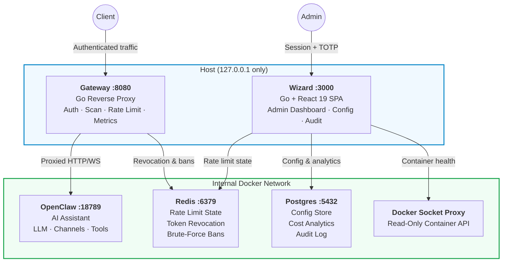
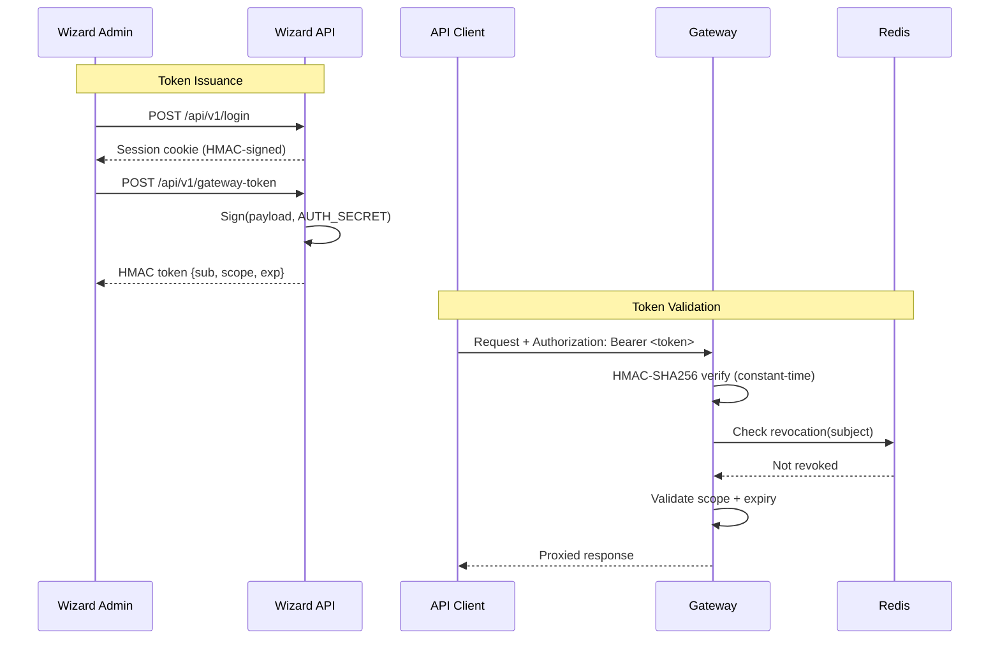
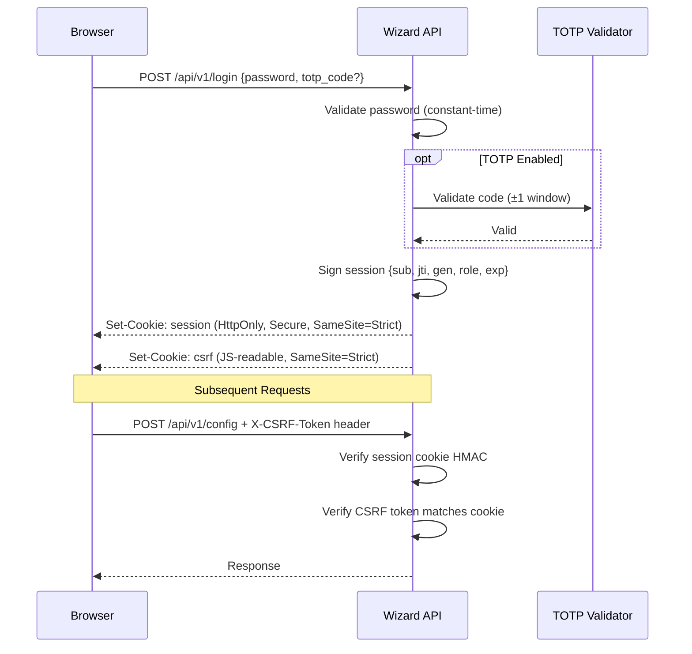
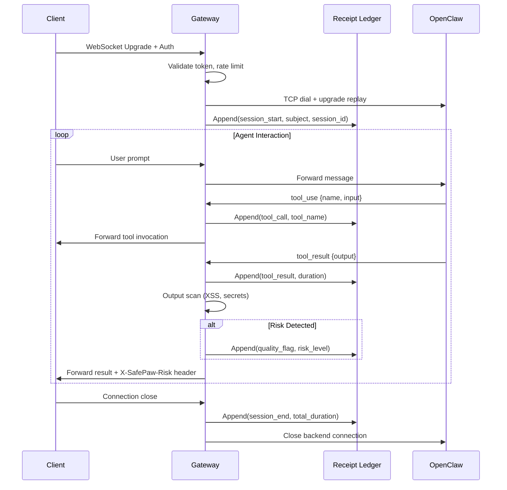
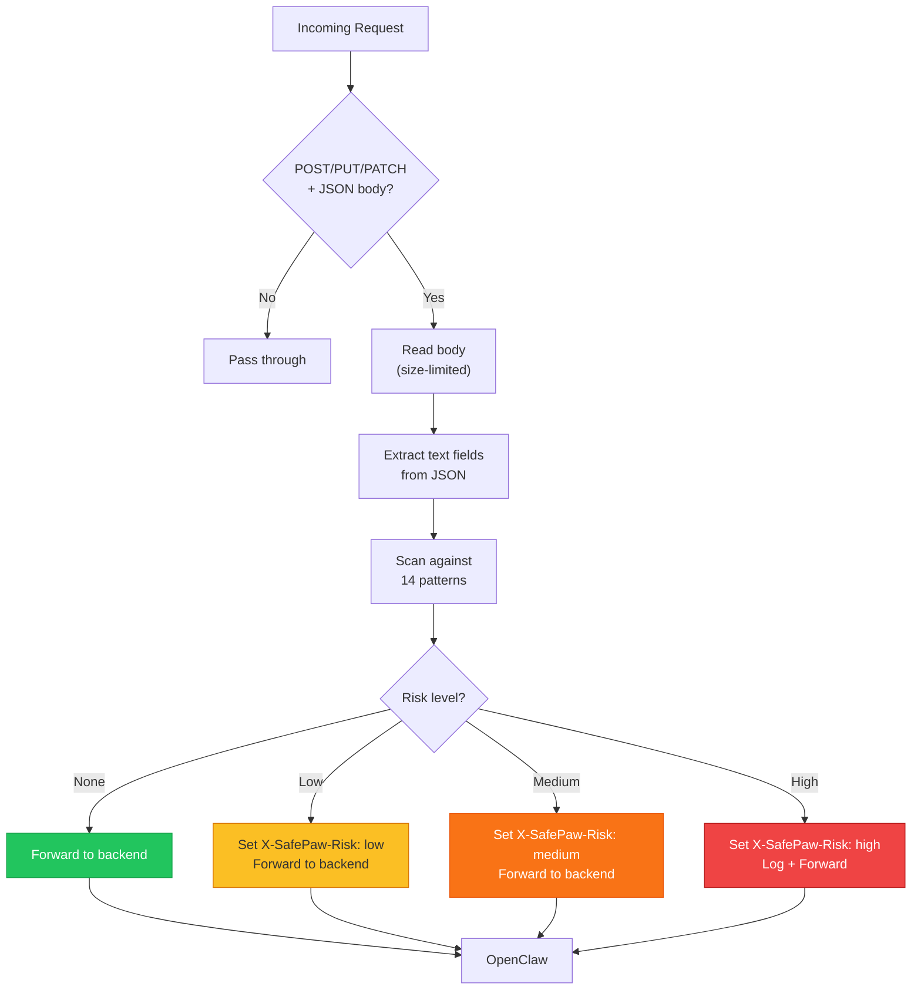
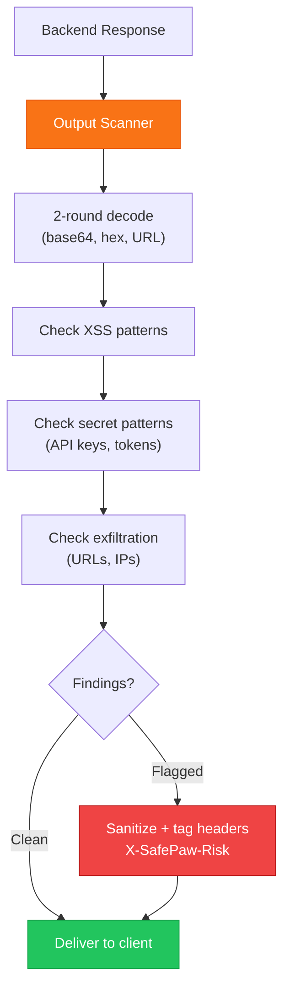
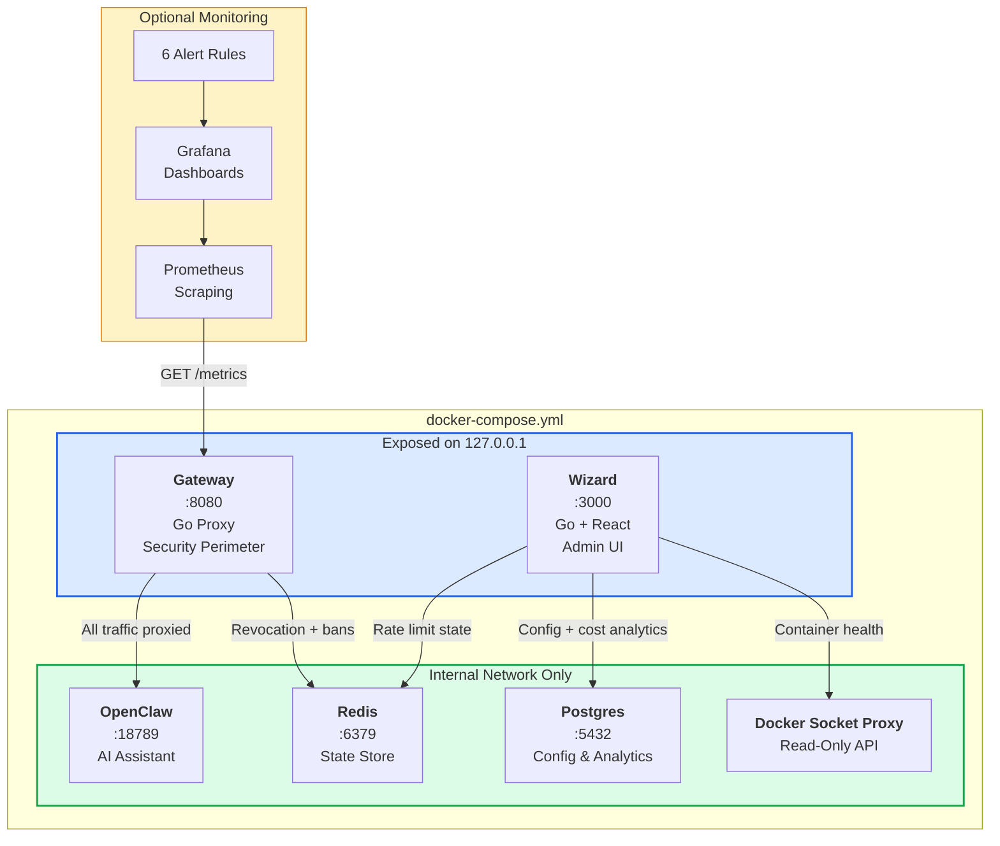
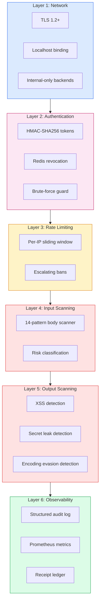
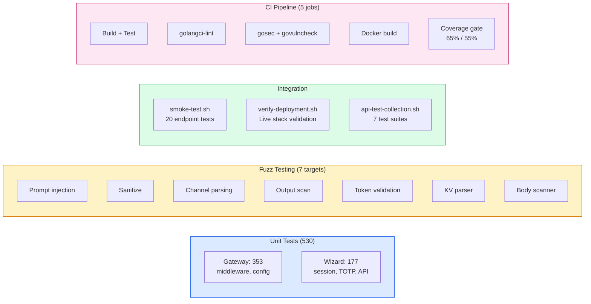

# Architecture Guide

> Complete technical architecture of InstallerClaw (SafePaw) — the security perimeter for self-hosted AI assistants.

## System Overview

InstallerClaw is a Go-based security gateway and administration wizard that wraps [OpenClaw](https://github.com/nicepkg/openclaw) in a hardened Docker environment. It provides authentication, rate limiting, prompt-injection scanning, observability, and guided setup through a single-command deployment.



## Components

### Gateway (Go)

The gateway is a security-hardened reverse proxy. Every request to OpenClaw passes through it.

| Capability | Implementation |
|-----------|---------------|
| Authentication | HMAC-SHA256 tokens (custom format, no JWT) |
| Token revocation | Redis-backed persistent revocation list |
| Rate limiting | Per-IP sliding window with configurable threshold |
| Brute-force protection | IP banning with escalating durations (5m → 15m → 60m → 240m) |
| Prompt injection scanning | 14 heuristic patterns on HTTP `POST/PUT/PATCH` with `application/json` body only. WebSocket chat messages are **not** scanned by the body scanner — they bypass this layer after the initial HTTP upgrade. |
| Output scanning | XSS, secret leak, encoding evasion detection on **HTTP responses only**. WebSocket streams are scanned and risk-logged but passed through unmodified — modifying payload bytes without updating binary frame headers would corrupt the stream and cause client failures. See `output_scanner.go` for the documented trade-off. |
| Security headers | HSTS, CSP, X-Frame-Options, X-Content-Type-Options |
| Request IDs | Server-generated UUID (client headers ignored) |
| Metrics | Prometheus-compatible text format at `/metrics` |
| WebSocket proxy | Full-duplex tunneling with receipt ledger instrumentation |
| Receipt ledger | Append-only agent action traceability (tool calls, results, sessions) |
| TLS | Optional TLS 1.2+ with strong cipher suites |

**Source:** `services/gateway/`  
**Dependencies:** 2 external (github.com/google/uuid, github.com/coder/websocket)

### Wizard (Go + React 19)

The wizard is a single-binary admin dashboard. The React SPA is embedded via `go:embed`.

| Capability | Implementation |
|-----------|---------------|
| Authentication | HMAC session cookies with optional TOTP MFA |
| CSRF protection | Double-submit cookie pattern |
| RBAC | Three roles: admin, operator, viewer |
| Config management | Allowlisted `.env` editing with masked secrets |
| Service health | Real-time Docker container status via socket proxy |
| Cost analytics | Postgres-backed daily rollup with per-model breakdown |
| Audit log | Login, config changes, restarts, token creations |
| Gateway integration | Token generation, metrics display, usage monitoring |

**Source:** `services/wizard/`  
**Dependencies:** 1 external (github.com/lib/pq)

## Middleware Pipeline

Every gateway request passes through this ordered middleware chain:

```mermaid
graph LR
    req(("Request")) --> M["Metrics<br/>Counter"]
    M --> SH["Security<br/>Headers"]
    SH --> RID["Request ID<br/>UUID"]
    RID --> AE["Audit<br/>Emitter"]
    AE --> OC["Origin<br/>Check"]
    OC --> BF["Brute-Force<br/>Guard"]
    BF --> RL["Rate<br/>Limiter"]
    RL --> AUTH["HMAC<br/>Auth"]
    AUTH --> BS["Body<br/>Scanner"]
    BS --> OS["Output<br/>Scanner"]
    OS --> PROXY["Reverse<br/>Proxy"]
    PROXY --> Backend["OpenClaw"]

    style req fill:#fbbf24,stroke:#d97706
    style AUTH fill:#3b82f6,stroke:#1d4ed8,color:#fff
    style BS fill:#f97316,stroke:#ea580c,color:#fff
    style OS fill:#f97316,stroke:#ea580c,color:#fff
    style Backend fill:#22c55e,stroke:#16a34a,color:#fff
```



Each middleware is a standard `http.Handler` wrapper. The chain is composed in `main.go`:

```go
handler = middleware.AuthRequiredWithGuard(auth, "proxy", revocations, bruteForce, handler)
handler = middleware.RateLimitWithGuard(rateLimiter, bruteForce, handler)
handler = middleware.BruteForceMiddleware(bruteForce, handler)
handler = middleware.OriginCheck(cfg.AllowedOrigins, handler)
handler = middleware.AuditEmitter(handler)
handler = middleware.RequestID(handler)
handler = middleware.SecurityHeaders(handler)
handler = middleware.MetricsMiddleware(metrics, handler)
```

## Authentication Flow

### Gateway Tokens (API/WebSocket)



**Token format:** `base64url(payload).base64url(hmac_sha256(payload, secret))`

**Payload fields:** `sub` (subject), `iat` (issued at), `exp` (expires), `scope` (permissions)

### Wizard Sessions (Browser)



## WebSocket Proxy & Receipt Ledger

The gateway provides full-duplex WebSocket proxying with agent action traceability:



**Receipt properties:**
- Monotonic sequence numbers (no gaps)
- Immutable entries (append-only)
- Bounded ring buffer (default 10,000 entries)
- Queryable by request_id, session_id, subject, action, time

## Prompt Injection Scanning

The body scanner inspects POST/PUT/PATCH JSON payloads for prompt injection patterns:



**14 Detection Patterns:**
1. System prompt override (`ignore previous instructions`)
2. Role hijacking (`you are now`)
3. Data exfiltration (`send to`, `curl`, URL patterns)
4. Jailbreak triggers (`DAN`, `developer mode`)
5. Encoding evasion (base64, hex, unicode)
6. Delimiter injection (markdown code blocks as prompt separators)
7. And more — versioned in `middleware/sanitize.go`

## Output Scanning

Response scanning catches data leakage and injection in backend responses:



## Deployment Architecture

### Docker Compose Stack



### Network Isolation

| Service | Exposed Port | Internal Port | Purpose |
|---------|-------------|---------------|---------|
| Wizard | 127.0.0.1:3000 | 3000 | Admin dashboard |
| Gateway | 127.0.0.1:8080 | 8080 | Security proxy |
| OpenClaw | — | 18789 | AI backend (internal only) |
| Redis | — | 6379 | State store (internal only) |
| Postgres | — | 5432 | Config/analytics (internal only) |
| Docker Socket Proxy | — | 2375 | Container API (internal only) |

### Resource Profiles

The stack auto-detects available RAM and applies resource limits:

| Profile | RAM | Gateway | Wizard | OpenClaw | Redis | Postgres |
|---------|-----|---------|--------|----------|-------|----------|
| Small | <4 GB | 256 MB | 256 MB | 512 MB | 128 MB | 256 MB |
| Medium | 4–8 GB | 512 MB | 512 MB | 2 GB | 256 MB | 512 MB |
| Large | 8–16 GB | 1 GB | 1 GB | 4 GB | 512 MB | 1 GB |
| Very Large | >16 GB | 2 GB | 1 GB | 8 GB | 1 GB | 2 GB |

## Security Architecture

### Defense-in-Depth Layers



### STRIDE Threat Coverage

48 threats identified and mitigated across all STRIDE categories. Full analysis: [THREAT-MODEL.md](../THREAT-MODEL.md).

| Category | Threats | Status |
|----------|---------|--------|
| **S**poofing | Token forgery, session hijacking, identity impersonation | Mitigated |
| **T**ampering | Request modification, header injection, log poisoning | Mitigated |
| **R**epudiation | Unattributed actions, missing audit trail | Mitigated |
| **I**nformation Disclosure | Secret leakage, data exfiltration, error verbosity | Mitigated |
| **D**enial of Service | Rate abuse, resource exhaustion, connection flooding | Mitigated |
| **E**levation of Privilege | Scope bypass, Docker socket abuse, admin escalation | Mitigated |

## Technology Decisions

All major architecture decisions are documented as ADRs in [docs/adr/](adr/):

| ADR | Decision | Rationale |
|-----|---------|-----------|
| [001](adr/001-hmac-tokens-not-jwt.md) | HMAC-SHA256 over JWT | Eliminates "alg:none" attacks, zero auth dependencies |
| [002](adr/002-zero-external-middleware-deps.md) | Zero middleware deps | 2 external packages total; minimal supply chain risk |
| [003](adr/003-go-for-gateway.md) | Go for the gateway | Single binary, stdlib controls, optimal for reverse proxy |
| [004](adr/004-docker-socket-proxy.md) | Docker socket proxy | Read-only container access; no privilege escalation |
| [005](adr/005-heuristic-scanning-not-ml.md) | Heuristic scanning | No ML dependency; versioned, auditable patterns |
| [006](adr/006-embedded-frontend.md) | Embedded React SPA | Single binary via go:embed; no CORS, atomic deploys |
| [007](adr/007-receipt-ledger.md) | Receipt ledger | Agent action traceability; append-only, bounded |
| [008](adr/008-csrf-double-submit.md) | CSRF double-submit | Stateless CSRF protection for SPA architecture |
| [009](adr/009-codespaces-url-routing.md) | Codespaces routing | Automatic port-forwarded URL detection |

## Testing Architecture



## Documentation Map

| Document | Focus Area |
|----------|-----------|
| [README.md](../README.md) | Project overview, quickstart, feature summary |
| [ARCHITECTURE.md](ARCHITECTURE.md) | This document — complete technical architecture |
| [SECURITY.md](../SECURITY.md) | Security posture, incident response, hardening |
| [THREAT-MODEL.md](../THREAT-MODEL.md) | STRIDE analysis, 48 threats, mitigations |
| [RUNBOOK.md](../RUNBOOK.md) | 6 operational playbooks, secret rotation |
| [BACKUP-RECOVERY.md](../BACKUP-RECOVERY.md) | Backup/restore procedures |
| [CONTRIBUTING.md](../CONTRIBUTING.md) | Development setup, coding standards |
| [CHANGELOG.md](../CHANGELOG.md) | Release history |
| [docs/adr/](adr/) | 9 Architecture Decision Records |
| [docs/COMPLIANCE.md](COMPLIANCE.md) | SOC 2 & GDPR control mapping |
| [docs/PENTEST-POLICY.md](PENTEST-POLICY.md) | Penetration testing scope |
| [docs/PATCHING-POLICY.md](PATCHING-POLICY.md) | Dependency update SLAs |
